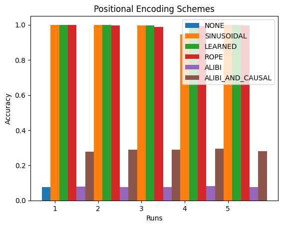
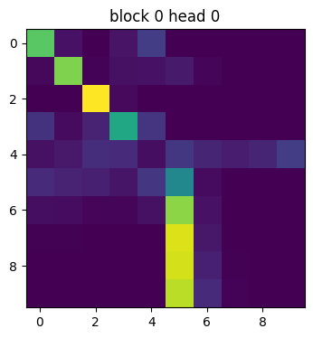
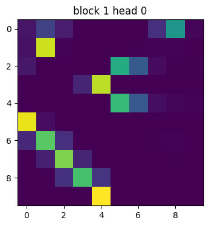
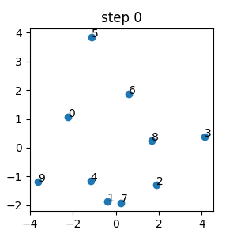
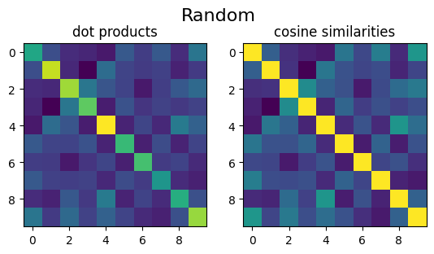
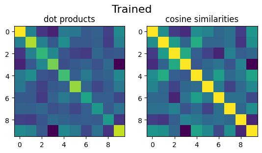
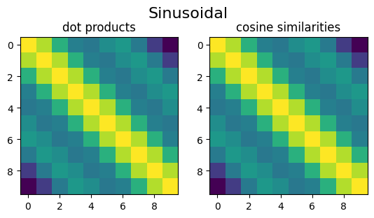

# Positional Encoding in Self-Attention
Take a look at different positional encoding schemes in self-attention:
- Sinusoidal [Attention Is All You Need](https://arxiv.org/pdf/1706.03762.pdf)
- Learned
- RoPE [RoFormer: Enhanced Transformer with Rotary Position Embedding](https://arxiv.org/pdf/2104.09864.pdf)
- ALiBi [Train Short, Test Long: Attention with Linear Biases Enables Input Length Extrapolation](https://arxiv.org/pdf/2108.12409.pdf)

## Copy-Task
The toy model will solve a copy-task. The goal is to copy the sequence before the `<copy>` token after it.

e.g.:
```
1 7 2 <copy> _ _ _ _ _ _ → 1 7 2 <copy> 1 7 2 _ _ _
9 <copy> _ _ _ _ _ _ _ _ → 9 <copy> 9 _ _ _ _ _ _ _
2 2 4 3 <copy> _ _ _ _ _ → 2 2 4 3 <copy> 2 2 4 3 _
1 2 3 4 5 6 7 <copy> _ _ → 1 2 3 4 5 6 7 <copy> 1 2
```

## Results
The model are trained on 2000 epochs, single-headed-attention, 2 layers, 20 embed_size. Each positional scheme is evaluated 5 times, and we plot the accuracy on the test set.



## Compare attention activations
Running on:
`7 1 8 2 <copy>  _ _ _ _ _ → 7 1 8 2 <copy> 7 1 8 2 _`




## Learned postional encoding over time
Positional encoding (PCA to 2D) over time.


## dot product / cosine similarity



